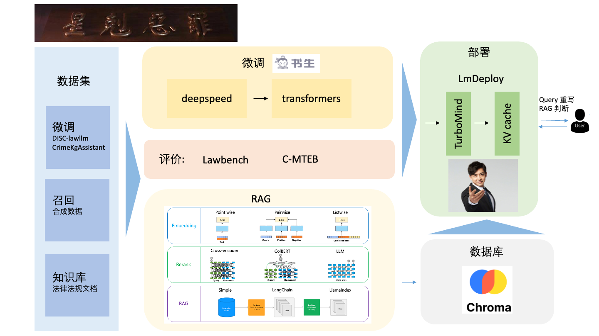

<h1 align="center">

</h1><br>


[书生·浦语 InternLM](https://github.com/InternLM) 第二期实践项目: 罪恶克星-法律大模型


## 项目目标

[详细文档](https://github.com/yuetan1988/lawer-llm/wiki)

**Vision**: 大语言模型助力全面依法治国

**Feature**: 
- 自由回答法律问题
- 根据上传资源，回答法律问题
- 上网搜索，挥发法律问题
- 根据上传资源，提供一定审计功能
- 项目过程中，我们也开源了RAG向量、排序的便捷微调工具[Open-retrievals](https://github.com/LongxingTan/open-retrievals)


## 技术路线




- continue pretrain
    - mixed data, hybrid-tuning
    - sentence-piece 词表扩充
- fine-tune
    - 数据: 配比, diversity, Self-Instruct, Self-QA, Self-KG
    - 减少幻觉: Generate with Citation, Factual Consistency Evaluation
- RAG
    - finetuned retrieval and rerank
    - multi-vector
    - rerank
- Other
    - judge if need rewriter
    - judge if need rag


## How to use it

### 激活环境
```shell
pip install -r requirements.txt
```

国内网络，环境变量设置
```shell
export HF_ENDPOINT=https://hf-mirror.com
```


### SFT

```shell
cd app/finetune
sh run.sh
```

### RAG
```
python -m app.rag
```


